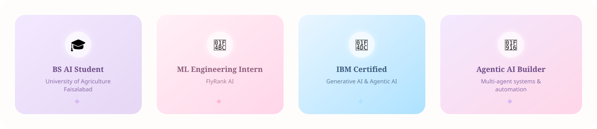

<div align="center">


<br/>


</div>

<br/>


## 🌸 &nbsp;Introduction

Hi, I'm **Sumra** — an AI Engineering student who genuinely loves the moment a system goes from *"it kind of works"* to *"oh, it actually reasons about this now."* That moment is what keeps me building.

I spend most of my time thinking about **Artificial Intelligence, Machine Learning, LLMs, and Agentic AI** — not as buzzwords, but as tools for building things that quietly make someone's workflow easier. I'm especially drawn to **automation** and the idea of designing agents that don't just answer, but plan, decide, and act. I like my systems useful more than I like them flashy.

I'm still early in this journey and I say that without apology — I'd rather be honestly learning than performatively finished. ☁️

<br/>

## 🪞 &nbsp;About Me

```yaml
name: Sumra Ahsan
role: AI Engineering Student & ML Engineering Intern
education: BS Artificial Intelligence — University of Agriculture Faisalabad (UAF)
internship: ML Engineering Intern @ FlyRank AI
interests:
  - Agentic AI & Autonomous Agents
  - Machine Learning
  - Large Language Models (LLMs)
  - Workflow Automation
  - Prompt Engineering
currently_learning: Advanced AI systems, multi-agent architectures, and applied ML
philosophy: "Learn in public, ship in private, improve in both."
```

<br/>

## 🌱 &nbsp;Current Focus

<table>
<tr>
<td width="50%" valign="top">

**🔭 Deepening**
- Machine Learning fundamentals & applied ML
- Retrieval-Augmented Generation (RAG)
- Multi-Agent Systems & orchestration

</td>
<td width="50%" valign="top">

**🛠️ Building**
- AI evaluation & testing practices
- Open-source contributions
- Original AI-driven projects

</td>
</tr>
</table>

<br/>

## 💜 &nbsp;Skills

<div align="center">

**🤖 Artificial Intelligence & Machine Learning**


**💻 Programming**


**🧰 Tools & Platforms**


**🌿 Version Control**


</div>

<br/>

## 🎓 &nbsp;Certifications

<table width="100%">
<tr>
<td width="50%">

**🧠 IBM — Generative AI**
<br/>Foundations of generative AI models and applications.

</td>
<td width="50%">

**🤖 IBM — Agentic AI**
<br/>Principles of building autonomous, goal-driven AI agents.

</td>
</tr>
<tr>
<td width="50%">

**✍️ Prompt Engineering**
<br/>Structured techniques for reliable, high-quality LLM outputs.

</td>
<td width="50%">

**🧮 freeCodeCamp — Scientific Computing with Python**
<br/>Applied Python for computational problem-solving.

</td>
</tr>
<tr>
<td width="50%" colspan="2">

**🖥️ Softicera Institute — Frontend Web Development**
<br/>Certified foundation in HTML, CSS, and JavaScript.

</td>
</tr>
</table>

<br/>

## 🚀 &nbsp;Featured Projects

<table width="100%">
<tr>
<td width="50%" valign="top">
<h3>📚 StudyFlow AI</h3>

An AI-assisted study companion designed to help organize learning material and streamline the study process using intelligent workflows.

 

<a href="https://github.com/SumraAhsan?tab=repositories">View Repository →</a>
</td>
<td width="50%" valign="top">
<h3>💬 AI Chatbot</h3>

A conversational chatbot built to explore natural language understanding and response generation using core AI/ML principles.

 

<a href="https://github.com/SumraAhsan?tab=repositories">View Repository →</a>
</td>
</tr>
<tr>
<td width="50%" valign="top">
<h3>💰 Budget Management System</h3>

A structured application for tracking, organizing, and managing personal or organizational budgets with clear, logical data handling.

 

<a href="https://github.com/SumraAhsan?tab=repositories">View Repository →</a>
</td>
<td width="50%" valign="top">
<h3>📊 Probability & Statistical Simulation</h3>

A simulation project applying probability and statistical methods to model and analyze real-world scenarios computationally.

 

<a href="https://github.com/SumraAhsan?tab=repositories">View Repository →</a>
</td>
</tr>
<tr>
<td width="100%" colspan="2" valign="top" align="center">
<h3>🌙 More Agentic AI Projects — In Progress</h3>

Currently building further Agentic AI and multi-agent systems projects. This space will keep growing. ✨

</td>
</tr>
</table>

<br/>

## 📈 &nbsp;GitHub Stats

<div align="center">


<br/><br/>


<br/><br/>



</div>

<br/>

<div align="center">

</div>

<br/>

<div align="center">

## ✨ &nbsp;A Little Something I Believe

> *"I don't just want to teach machines to answer — I want to teach them to think alongside us, quietly, patiently, and with purpose."*

</div>

<br/>

## 💌 &nbsp;Let's Connect

<div align="center">

<a href="https://github.com/SumraAhsan"></a>
<a href="https://www.linkedin.com/in/sumraahsan27/"></a>
<a href="mailto:sumraahsan001@gmail.com"></a>

</div>

<br/>


<br/><br/>

<div align="center">

</div>
